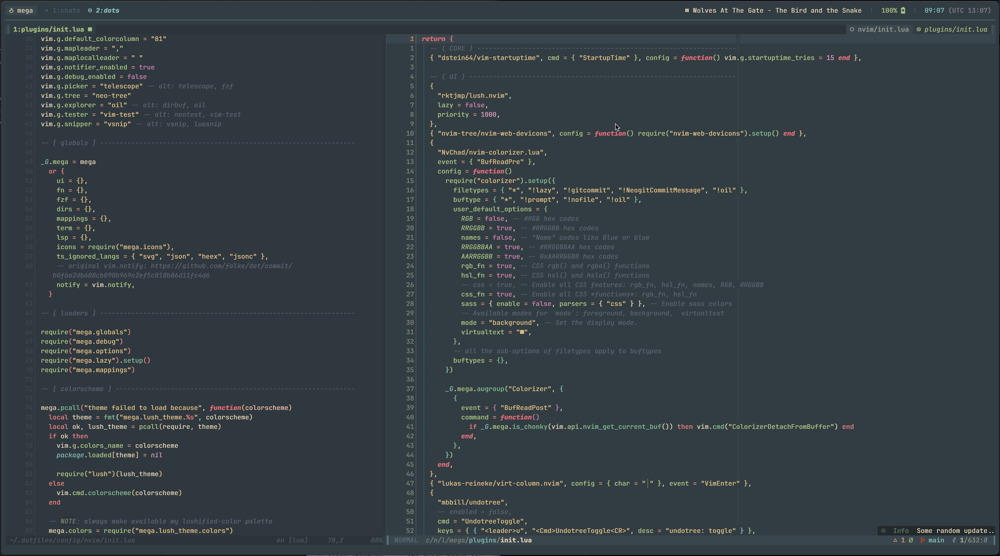

```

     ┌┬┐┌─┐┌─┐┌─┐┬  ┬┌┬┐┬ ┬┬┌─┐
     │││├┤ │ ┬├─┤│  │ │ ├─┤││   :: bits & bobs, dots & things.
     ┴ ┴└─┘└─┘┴ ┴┴─┘┴ ┴ ┴ ┴┴└─┘
     @megalithic

```

<p align="center">
  
</p>

### Installation

If you want to kick the tires, you can simply:

```sh
curl -fsSL https://raw.githubusercontent.com/megalithic/dotfiles/master/bin/_dotup | /usr/bin/env zsh
```

The install script will install things and symlink the appropriate files in
`~/.dotfiles` to your home directory (`~`). Everything is configured and tweaked
within `~/.dotfiles`, though. All files and folders ending in `.symlink` get --
you guessed it -- symlinked. For example: `~/.dotfiles/zsh/zshrc.symlink` gets
symlinked to `~/.zshrc`.

This also sets up things like homebrew if you're on a mac, and even allows for a
private repo setup. **Please note**, this dotfiles repo supports multiple
platforms, but has really only been extensively used and tested on MacOS.

I highly recommend you dig into the scripts and configs to see what all
is going on (because it does a lot that I'm not describing here) before you
install a stranger's shell scripts all willy-nilly, throwing caution to the
wind. 🤣

### Things

A few of the _must-have_ tools I roll with:

- [homebrew](https://brew.sh/)
  - see `~/.dotfiles/homebrew/Brewfile` for all that gets installed
- [hammerspoon](https://github.com/megalithic/dotfiles/tree/master/hammerspoon)
- [karabiner-elements](https://github.com/tekezo/Karabiner-Elements)
  - see `~/.dotfiles/keyboard` for macOS specific config things
  - see my [QMK dz60 config](https://github.com/megalithic/qmk_firmware/tree/master/keyboards/dz60/keymaps/megalithic) for my custom keyboard setup
- [tmux](https://github.com/tmux/tmux/wiki)
  - additional tmux statusbar binaries available (see `tmux-*` files in
    `~/.dotfiles/bin`).
  - see also my [DND tmux plugin](https://github.com/megalithic/tmux-dnd-status)
- [jetbrains mono](https://www.jetbrains.com/lp/mono/)
  - patched via [nerd-fonts](https://github.com/ryanoasis/nerd-fonts#font-patcher)
- [kitty](https://github.com/kovidgoyal/kitty)
- [nova](https://github.com/trevordmiller/nova-colors)
- [neovim](https://neovim.io/)
  - using lua with neovim? https://github.com/nanotee/nvim-lua-guide
- [zsh](https://www.zsh.org/)
  - custom prompt (mimicking [pure](https://github.com/sindresorhus/pure)), using [gitstatus](https://github.com/romkatv/gitstatus) for fast git-specific vcs status.
- [weechat](https://www.weechat.org/)

### Stuff

The file hierarchy:

- **bin/**: Anything in `bin/` will get added to your `$PATH` and be made
  available everywhere.
- **topic/\*.symlink**: Any files ending in `*.symlink` get symlinked into
  your `$HOME`. This is so you can keep all of those versioned in your dotfiles
  but still keep those autoloaded files in your home directory. These get
  symlinked when you run `bin/_dotup`, or you can explicitly run `bin/_symlinks`.
- **topic/\<platform\>.sh**: Platform-specific installers to handle additional
  things that you may need to happen for that topic. `all | macos | linux | freebsd | windows`

### Privates

Use `~/.localrc` as your location for sensitive information. ~~Optionally, you
can let `bin/_dotup` handle the cloning of your private repo to
`~/.dotfiles/private`, which will execute an install script, assuming it's
located at `~/.dotfiles/private/install.sh`.~~

### Props

- So many esteemed individuals in the community have, in some way, left their
  mark on my own dotfilery:

  * [Zach Holman](https://github.com/holman/dotfiles)
  * [Wynn Netherland](https://github.com/pengwynn/dotfiles)
  * [Evan Travers](https://github.com/evantravers/dotfiles)
  * [Dorian Karter](https://github.com/dkarter/dotfiles)
  * [Phil Ridlen](https://github.com/philtr/dotfiles)

### Refs

- A wealth of handy scripts/bins: https://github.com/salman-abedin/alfred

<p align="center" style="margin-top: 20px;">
  
</p>
